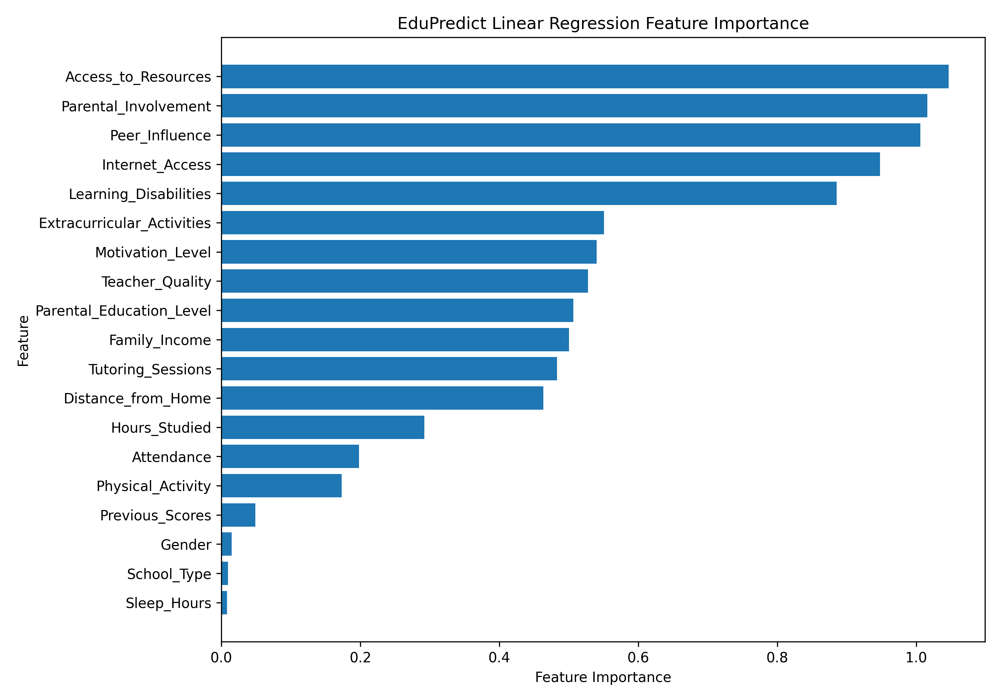
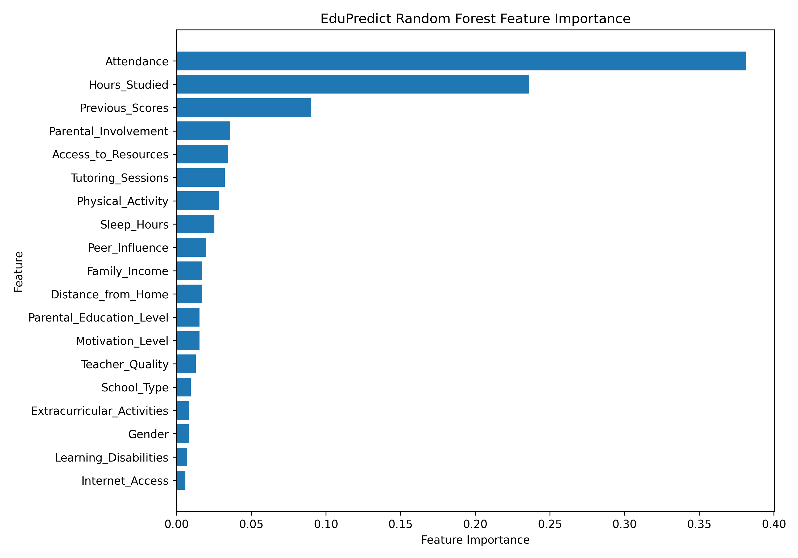
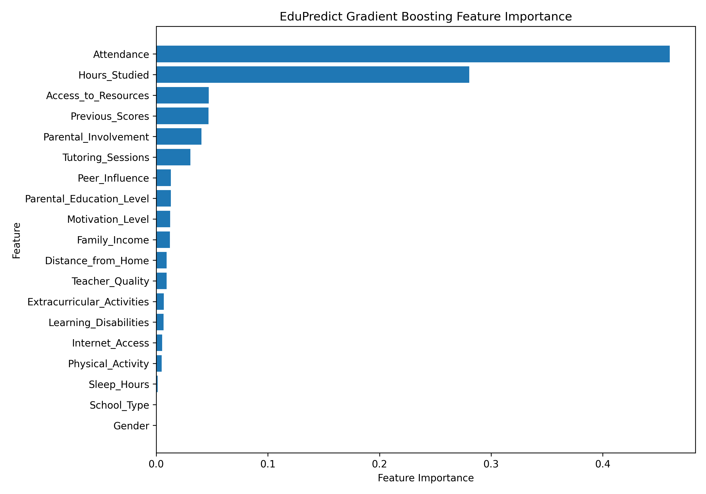

# EduPredict

> **CV summary** — Built an end-to-end machine-learning application that predicts student exam performance from academic, behavioural, lifestyle, family, and school factors. The project covers data validation, missing-value handling, ordinal and one-hot encoding, model comparison, feature-importance analysis, REST API development, model selection, and an interactive React frontend. It demonstrates practical skills in Python, pandas, scikit-learn, FastAPI, joblib, Matplotlib, React, TypeScript, Vite, API integration, and reproducible experimentation.

<p align="center">
  
  
  
  
  
</p>

EduPredict is an educational analytics application for exploring how student characteristics relate to predicted exam performance. Users can adjust a student profile, choose between three trained regression models, and receive a prediction through a FastAPI service.

The application is designed as a transparent modelling demonstration: its predictions are estimates based on the supplied dataset, not guarantees of academic outcomes.

## Contents

- [Project highlights](#project-highlights)
- [Experiment results](#experiment-results)
- [What the results show](#what-the-results-show)
- [Feature-importance visualizations](#feature-importance-visualizations)
- [System architecture](#system-architecture)
- [Dataset](#dataset)
- [Requirements](#requirements)
- [Run the application](#run-the-application)
- [Train the models](#train-the-models)
- [Generate visualizations](#generate-visualizations)
- [API reference](#api-reference)
- [Project structure](#project-structure)
- [Verification](#verification)
- [Limitations and responsible use](#limitations-and-responsible-use)
- [License](#license)

## Project highlights

- End-to-end regression workflow from CSV data to an interactive web application.
- Shared preprocessing pipeline for numeric, ordinal, binary, and nominal features.
- Three model implementations with separate saved artifacts:
  - Linear Regression
  - Random Forest Regression
  - Gradient Boosting Regression
- Reproducible train/test evaluation using an 80/20 split and `random_state=42`.
- Five-fold grid search for Gradient Boosting; direct training for Linear Regression and Random Forest.
- Feature-importance visualizations generated independently for every model.
- FastAPI endpoint with validated model selection and a React/TypeScript client.
- Clear separation between source code, trained models, generated visualizations, and frontend code.

## Experiment results

The dataset contains 6,607 records and 20 columns, including the `Exam_Score` target. Scores outside the 0–100 range are removed before training. Each model is evaluated on the same held-out test set.

| Model | Test MAE ↓ | Test R² ↑ | Training approach |
| --- | ---: | ---: | --- |
| **Linear Regression** | **0.4107** | **0.8258** | Direct fit |
| **Gradient Boosting** | 0.5676 | 0.8105 | Five-fold grid search |
| **Random Forest** | 1.0549 | 0.7051 | Direct fit, `random_state=42` |

### Metric definitions

- **Mean Absolute Error (MAE):** the average absolute difference between the predicted and actual exam score. Lower is better; an MAE of `0.4107` means the Linear Regression predictions were approximately 0.41 score points away from the observed values on average for this test split.
- **R² score:** the proportion of variance in the held-out target explained by the model. Higher is better; `0.8258` indicates that Linear Regression explained approximately 82.6% of the variance in this evaluation.

### Methodology

1. Load `StudentPerformanceFactors.csv` with pandas.
2. Keep rows where `Exam_Score` is between 0 and 100.
3. Separate the target from the 19 predictor variables.
4. Split the data into training and test sets with `test_size=0.2` and `random_state=42`.
5. Fit the shared preprocessing pipeline only on the training data through a scikit-learn `Pipeline`.
6. Train and evaluate the selected regression model.
7. Save the complete preprocessing-plus-model pipeline with joblib.

The preprocessing pipeline uses median imputation for numeric fields, ordered ordinal encoding for ranked categories, and one-hot encoding for binary and nominal categories. This ensures the same transformations are applied during training and API inference.

## What the results show

Linear Regression produced the strongest score on this held-out split, with both the lowest MAE and highest R². This suggests that the relationships represented in this dataset are sufficiently regular for a linear model to perform strongly, while also making the model relatively easy to inspect through its coefficients.

Gradient Boosting was a close second. Its ensemble of shallow regression trees can capture non-linear relationships and interactions, and its tuned configuration performed substantially better than the Random Forest configuration used in this experiment.

Random Forest produced the weakest result of the three under the selected configuration. This is an experimental comparison rather than a universal ranking: changing hyperparameters, validation strategy, feature engineering, or the source data could change the outcome.

Across the tree-based feature visualizations, `Attendance`, `Hours_Studied`, and `Previous_Scores` are among the most influential inputs. This indicates that the models rely heavily on academic engagement and prior performance. Feature importance shows model reliance and association; it does not prove that changing one factor alone causes a particular score change.

## Feature-importance visualizations

The following charts are generated by `backend/src/visualize.py`. Linear Regression uses the absolute value of its coefficients, while Random Forest and Gradient Boosting use their native tree-based importance scores. Encoded categories are cleaned and grouped for readability.

<p align="center">
  
  
  
</p>

## System architecture

```text
┌──────────────────────┐       JSON POST /predict       ┌──────────────────────┐
│ React + TypeScript   │ ────────────────────────────▶ │ FastAPI               │
│ Interactive profile  │                               │ Request validation    │
│ Model selector       │ ◀──────────────────────────── │ Model routing         │
└──────────────────────┘        score + model          └──────────┬───────────┘
                                                                  │
                                          selected model key       │
                                                                  ▼
                                                   ┌──────────────────────────┐
                                                   │ Saved scikit-learn model │
                                                   │ .pkl pipeline             │
                                                   └──────────────────────────┘
```

The frontend sends one of the following model keys:

| UI label | API key | Saved artifact |
| --- | --- | --- |
| Linear Regression | `linear_regression` | `backend/models/linear_regression_model.pkl` |
| Random Forest | `random_forest` | `backend/models/random_forest_model.pkl` |
| Gradient Boosting | `gradient_boosting` | `backend/models/gradient_boosting_model.pkl` |

FastAPI loads all three pipelines at startup and uses a whitelist of allowed keys, so the client cannot select an arbitrary file path.

## Dataset

The project uses the [Student Performance Factors dataset on Kaggle](https://www.kaggle.com/datasets/lainguyn123/student-performance-factors), which contains academic, behavioural, lifestyle, family, and school-related factors associated with exam performance.

### Dataset profile

- **Local file:** `backend/data/StudentPerformanceFactors.csv`
- **Rows:** 6,607
- **Columns:** 20 total — 19 predictors and the `Exam_Score` target
- **Task:** supervised regression
- **Target:** `Exam_Score`
- **Dataset license:** CC0: Public Domain, as listed on the Kaggle dataset page

### Main feature groups

| Group | Examples |
| --- | --- |
| Academic and habits | `Hours_Studied`, `Attendance`, `Previous_Scores`, `Sleep_Hours`, `Tutoring_Sessions`, `Physical_Activity` |
| Support and environment | `Parental_Involvement`, `Access_to_Resources`, `Teacher_Quality`, `Distance_from_Home` |
| Background and access | `Family_Income`, `Parental_Education_Level`, `Internet_Access`, `School_Type` |
| Personal and social | `Motivation_Level`, `Peer_Influence`, `Extracurricular_Activities`, `Learning_Disabilities`, `Gender` |

The dataset license applies to the dataset. It is separate from the MIT license for this project’s source code.

## Requirements

### Backend

- Python 3.11 or newer
- The Python packages listed in [`requirements.txt`](requirements.txt):
  - pandas
  - joblib
  - scikit-learn
  - matplotlib
  - fastapi
  - uvicorn
  - pydantic

### Frontend

- Node.js 20 or newer
- npm
- Dependencies listed in [`frontend/package.json`](frontend/package.json)

## Run the application

All commands below are run from the repository root unless stated otherwise.

### 1. Set up the Python environment

Windows PowerShell:

```powershell
python -m venv .venv
.\.venv\Scripts\Activate.ps1
pip install -r requirements.txt
```

macOS/Linux:

```bash
python3 -m venv .venv
source .venv/bin/activate
pip install -r requirements.txt
```

### 2. Ensure the model artifacts exist

The API expects these three files in `backend/models/`. If needed, train them with:

```bash
python backend/src/train_LinearRegression.py
python backend/src/train_RandomForest.py
python backend/src/train_GradientBoosting.py
```

Each script saves a separate model file and does not overwrite the other two.

### 3. Start the FastAPI backend

```bash
uvicorn backend.app:app --reload
```

The API is available at `http://127.0.0.1:8000`.

Interactive API documentation is available at:

- Swagger UI: `http://127.0.0.1:8000/docs`
- ReDoc: `http://127.0.0.1:8000/redoc`

### 4. Start the React frontend

Open a second terminal:

```bash
cd frontend
npm install
npm run dev
```

Open the local URL printed by Vite, typically `http://localhost:5173`.

The model selector in the interface sends the selected model key to FastAPI for each prediction request.

## Train the models

Each training script follows the same overall structure and shared preprocessing pipeline.

### Linear Regression

```bash
python backend/src/train_LinearRegression.py
```

Uses `sklearn.linear_model.LinearRegression` and saves:

```text
backend/models/linear_regression_model.pkl
```

The feature-importance report uses the absolute value of the fitted coefficients.

### Random Forest

```bash
python backend/src/train_RandomForest.py
```

Uses `sklearn.ensemble.RandomForestRegressor` and saves:

```text
backend/models/random_forest_model.pkl
```

The model is trained directly without grid search and reports the forest’s native feature-importance scores.

### Gradient Boosting

```bash
python backend/src/train_GradientBoosting.py
```

Uses `sklearn.ensemble.GradientBoostingRegressor` with five-fold `GridSearchCV` over estimator count, learning rate, and tree depth. It saves:

```text
backend/models/gradient_boosting_model.pkl
```

## Generate visualizations

After the three model files have been created, run:

```bash
python backend/src/visualize.py
```

The script saves the graphs in the repository root:

```text
linear_regression_feature_importance.png
random_forest_feature_importance.png
gradient_boosting_feature_importance.png
```

## API reference

### `GET /`

Health check:

```json
{
  "message": "EduPredict API is running"
}
```

### `POST /predict`

The `model` field selects the trained pipeline. It defaults to `gradient_boosting` when omitted.

Example request:

```json
{
  "model": "gradient_boosting",
  "Hours_Studied": 20,
  "Attendance": 80,
  "Parental_Involvement": "Medium",
  "Access_to_Resources": "Medium",
  "Extracurricular_Activities": "Yes",
  "Sleep_Hours": 7,
  "Previous_Scores": 70,
  "Motivation_Level": "Medium",
  "Internet_Access": "Yes",
  "Tutoring_Sessions": 2,
  "Family_Income": "Medium",
  "Teacher_Quality": "Medium",
  "Physical_Activity": 5,
  "Learning_Disabilities": "No",
  "Parental_Education_Level": "College",
  "Distance_from_Home": "Moderate",
  "School_Type": "Public",
  "Peer_Influence": "Neutral",
  "Gender": "Male"
}
```

Example response:

```json
{
  "predicted_score": 67.05,
  "model": "gradient_boosting"
}
```

Invalid model keys are rejected by FastAPI validation with a `422 Unprocessable Entity` response.

## Project structure

```text
Edu Predict/
├── backend/
│   ├── app.py                              # FastAPI application and model routing
│   ├── data/
│   │   └── StudentPerformanceFactors.csv   # Local dataset
│   ├── models/                             # Saved model pipelines
│   │   ├── gradient_boosting_model.pkl
│   │   ├── linear_regression_model.pkl
│   │   └── random_forest_model.pkl
│   └── src/
│       ├── preprocessing.py                # Shared feature preprocessing
│       ├── train_GradientBoosting.py       # Tuned Gradient Boosting training
│       ├── train_LinearRegression.py       # Linear Regression training
│       ├── train_RandomForest.py           # Random Forest training
│       ├── predict.py                      # Standalone prediction example
│       └── visualize.py                    # Model explainability charts
├── frontend/
│   ├── src/
│   │   ├── App.tsx                         # React interface and model selector
│   │   ├── App.css                         # Application styling
│   │   └── index.css                       # Global styles
│   ├── package.json
│   └── vite.config.ts
├── gradient_boosting_feature_importance.png
├── linear_regression_feature_importance.png
├── random_forest_feature_importance.png
├── LICENSE                                 # MIT license for project code
├── requirements.txt
└── README.md
```

## Verification

The project has been checked with:

```bash
python -m py_compile backend/app.py backend/src/visualize.py
```

Frontend checks:

```bash
cd frontend
npm run lint
npm run build
```

The model-routing path has also been exercised for all three model keys, confirming that each key returns a prediction from its corresponding saved pipeline.

## Limitations and responsible use

- The reported metrics come from one fixed train/test split and should not be treated as a guarantee of performance on new populations.
- The dataset may contain sampling, measurement, or data-generation limitations that affect generalisation.
- Feature importance describes association and model behaviour, not causation.
- Predictions should support exploration and discussion, not determine admissions, interventions, grades, or access to education.
- No personal student data should be committed to the repository.
- Retrain the models after changing preprocessing, feature definitions, or source data.

## License

The EduPredict source code is released under the [MIT License](LICENSE).

The dataset is sourced from Kaggle and is listed there under the [CC0: Public Domain license](https://www.kaggle.com/datasets/lainguyn123/student-performance-factors). Dataset licensing is independent of this project’s source-code license.

## Author

Built by **tionchi** as a portfolio project demonstrating applied machine learning, model evaluation, explainability, API engineering, and frontend product development.
